# Mashiko_himawari_3

<html lang="ja">
 <head>
  <meta charset="utf-8" />
  <meta name="viewport" content="width=device-width, initial-scale=1.0"> 

<link href="https://cdnjs.cloudflare.com/ajax/libs/lightbox2/2.7.1/css/lightbox.css" rel="stylesheet">
 
</head>
<body>

  モバイル端末をお使いの場合は、画面を横向きにすると
  より見やすくご覧頂けます。

<a href="https://torokoid.github.io/mashiko_himawari/">2018年、2019年</a>><a href="https://torokoid.github.io/mashiko_himawari_2/">2021年</a>>2023年 ><a href="https://torokoid.github.io/2024Jan_Thailand__7/">タイ植物園リンク</a> ><a href="https://torokoid.github.io/2024_Sakura/" target="_blank">2024城址公園桜リンク</a> ><a href="https://torokoid.github.io/2024_hitachi_kaihin/" target="_blank">2024/4/20ひたち海浜公園</a> ><a href="https://torokoid.github.io/2024Apr_Maronie/" target="_blank">2024/4/27マロニエプラザ絵画展</a> ><a href="https://torokoid.github.io/hagurosan/" target="_blank">ちょい古&マニアック、羽黒山から無線した記録</a> ><a href="https://torokoid.github.io/mt_fuji/" target="_blank">2023年12月の富士山</a> ><a href="https://torokoid.github.io/hagurosan2/" target="_blank">2022年4月、羽黒山のツツジ</a> ><a href="https://torokoid.github.io/2024May_tanboref/" target="_blank">2024年5月、年に一度の田植え時期に見える、田んぼリフレクション</a> ><a href="https://torokoid.github.io/kodomonomori/" target="_blank">宇都宮郊外の意外な穴場スポット「こどものもり公園」</a> ><a href="https://torokoid.github.io/park-s-flower/" target="_blank">宇都宮市内、公園のお花が満開</a> ><a href="https://twitter.com/sajyan" target="_blank">Xアカウントリンク、ほぼ毎日更新中</a> ><a href="https://torokoid.github.io/2024May25_kenmin/" target="_blank">県民の森にバイクでお出かけ</a>><a href="https://torokoid.github.io/2024May_Kenmin_forest/" target="_blank">実は前の週にも県民の森</a> ><a href="https://torokoid.github.io/20240526_HF_ant/" target="_blank">超マニアック、アマチュア無線のアンテナの話</a> ><a href="https://torokoid.github.io/20240622_flower/" target="_blank">梅雨入り直前のお花たちを集めました</a> ><a href="https://torokoid.github.io/20240630_flower/" target="_blank">梅雨時のしっとりしたお花たちです</a> ><a href="https://torokoid.github.io/2023_thailand/" target="_blank">2023年、タイの日常風景</a> ><a href="https://torokoid.github.io/2024Jul_tatekae/" target="_blank">2024年7月、お隣の家が建て替えで取り壊し</a> ><a href="https://torokoid.github.io/2024_paris11/" target="_blank">2024年8月、高校の同級生（Bruce君）が訪れたフランスの写真集</a> ><a href="https://torokoid.github.io/Mashiko_himawari_4/" target="_blank">2024年8月10日、益子ひまわり祭り写真集</a> ><a href="https://torokoid.github.io/20240817_hagurosan/" target="_blank">2024年8月17日、羽黒山にお詣りと関東平野一望</a> ><a href="https://torokoid.github.io/2023_thailand/" target="_blank">2024年8月31日、42年間勤めたHondaを無事退職</a> ><a href="https://torokoid.github.io/after_911/" target="_blank">NHK9.11特集番組より、2001年9月11日アメリカ同時多発テロの直後に起こった出来事</a> ><a href="https://torokoid.github.io/2024Aug_tatekae3/" target="_blank">2024年8月23日、お隣の敷地が地鎮祭〜新築工事</a> ><a href="https://torokoid.github.io/20240930_hagurosan/" target="_blank">2024年9月30日、彼岸花の季節に羽黒山</a> ><a href="https://torokoid.github.io/20241003_cluster/" target="_blank">2024年10月3日、メタバース空間のcluster主催者からCluster Acceleratorに推薦されたとの連絡！</a> ><a href="https://torokoid.github.io/20241004_fukuwauchi/" target="_blank">2024年10月4日、定年退職１ヶ月後に旧職場のメンバーが飲み会を開催してくれました！</a> ><a href="https://torokoid.github.io/2024Oct14_cosmos/" target="_blank">2024年10月14日、鬼怒川グリーンパークのコスモスが綺麗！</a> ><a href="https://torokoid.github.io/2024Oct23_85Kenyuukai/" target="_blank">2024年10月23日、銀座散策と品川から屋形船あそび！</a> ><a href="https://torokoid.github.io/20241103_Ibaraki_bike/" target="_blank">2024年11月3日、バイクツーリング、背景画像の３台目は女性ライダー！</a> ><a href="https://torokoid.github.io/20241116_ClusteMBG-6-/" target="_blank">2024年11月16日、メタバース内で開催された音楽イベント。マイティヤさんの曲はTVで放送できるレベル！</a> ><a href="https://torokoid.github.io/20241118_hagurosan/" target="_blank">2024年11月18日、20日のタイ旅行に先立ち、羽黒山神社で安全祈願！</a>  ><a href="https://torokoid.github.io/20241120-20250311_Thailand/" target="_blank">2024年11月20日~2025年3月11日、タイの旅、まとめ！</a>

<!--
><a href="https://torokoid.github.io/20241120_bangkok/" target="_blank">2024年11月20日、宇都宮からマロニエバスで成田に移動、バンコクから北部チェンライまでの旅！</a> ><a href="https://torokoid.github.io/20241129_KunFhone_Wedding/" target="_blank">2024年11月29日、ドイツ人男性と現地人女性の結婚式に出席</a> ><a href="https://torokoid.github.io/20241130_chiangrai/" target="_blank">2024年11月30日 、チェンライ近郊にスイミングプール見つけました</a> ><a href="https://torokoid.github.io/20241202_chiangrai/" target="_blank">2024/11/29〜12/02 、チェンライ近郊の散策状況</a> ><a href="https://torokoid.github.io/20241204_chiangrai/" target="_blank">2024/12/03〜12/04 、チェンライで過ごす日々のまとめ</a> ><a href="https://torokoid.github.io/20241207_chiangrai/" target="_blank">2024/12/05〜12/07 、チェンライ周辺のお花などまとめました</a> ><a href="https://torokoid.github.io/20241209_chiangrai/" target="_blank">2024/12/08〜12/09 、チェンライ、日常の一コマ</a> ><a href="https://torokoid.github.io/20241210_chiangrai/" target="_blank">2024/12/10 、チェンライ郊外、メーチャン、チャンチャワー町の市場</a> ><a href="https://torokoid.github.io/20241213_chiangrai/" target="_blank">2024/12/13 、メーチャン中心部で毎週金曜日に開催される巨大市場</a> ><a href="https://torokoid.github.io/20241215_chiangrai/" target="_blank">2024/12/15 、メーチャン市街から西に5分ほど行ったところにあるパトゥーン温泉</a> ><a href="https://torokoid.github.io/20241216_chiangrai/" target="_blank">2024/12/16 、チェンライ近郊の大規模ショッピングモールを２店はしご</a> ><a href="https://torokoid.github.io/20241219_chiangrai/" target="_blank">2024/12/19 、タイ渡航５週目になったのを機に、４週目までのお花画像まとめ</a> ><a href="https://torokoid.github.io/20241220_chiangrai/" target="_blank">2024/12/20 、収穫されたカカオの実を天日干しなど</a> ><a href="https://torokoid.github.io/20241223_chiangrai/" target="_blank">2024/12/23 、南国の夕焼け空と入道雲を集めました(30Dec:グラデーションが綺麗に見えるように画像解像度をアップ)</a> ><a href="https://torokoid.github.io/20241224_chiangrai/" target="_blank">2024/12/24 、日本とは違うタイの特徴的なところを何点かまとめました</a> ><a href="https://torokoid.github.io/20241226_chiangrai/" target="_blank">2024/12/26 、地方のごく一般的な集落で、年に一回開催されるローカルなお祭り</a> ><a href="https://torokoid.github.io/20241227_chiangrai/" target="_blank">2024/12/27 、タイ北部の植物園を観光</a> ><a href="https://torokoid.github.io/20241227_chiangrai_home/" target="_blank">2024/12/27お昼 、タイ地方都市の一般的なご家庭を訪問</a> ><a href="https://torokoid.github.io/20241230_chiangrai/" target="_blank">2024/12/30 、さすがタイ、プール付きのレストランがありました</a> ><a href="https://torokoid.github.io/20241231_chiangrai/" target="_blank">2024/12/31 、大晦日に、やや細かい現地情報</a> ><a href="https://torokoid.github.io/20250101_chiangrai/" target="_blank">2025/01/01 、年末からお正月にかけてのタイのお空は賑やか！</a> ><a href="https://torokoid.github.io/20250102_chiangrai/" target="_blank">2025/01/02 、タイのお正月は1日で終わり、2日は以前天日干しにしたカカオを収穫！</a> ><a href="https://torokoid.github.io/20250103_chiangrai/" target="_blank">2025/01/03 、庭木に咲いたお花の蜜集めで蝶々と蜜蜂が集まりました</a> ><a href="https://torokoid.github.io/20250104_chiangrai/" target="_blank">2025/01/04 、この時期の綺麗な夕暮れグラデーションなど</a> ><a href="https://torokoid.github.io/20250105_chiangrai/" target="_blank">2025/01/05 、庭の鶏にヒナがかえって総勢20羽の子育てがスタート</a> ><a href="https://torokoid.github.io/20250106_chiangrai/" target="_blank">2025/01/06 、ニワトリの大家族をかごから引っ越しする小屋の建築</a> ><a href="https://torokoid.github.io/20250107_chiangrai/" target="_blank">2025/01/07 、仏教国タイの特徴的な部分をピックアップ</a> ><a href="https://torokoid.github.io/20250108_chiangrai/" target="_blank">2025/01/08 、大学校内の道路を使った毎週水曜開催の市場を訪問</a> ><a href="https://torokoid.github.io/20250109_chiangrai/" target="_blank">2025/01/09 、ショッピングモールで地域振興のイベントを見学</a> ><a href="https://torokoid.github.io/20250110_chiangrai/" target="_blank">2025/01/10 、ショッピングモール内、スーパーや周辺の状況など</a> ><a href="https://torokoid.github.io/20250111_chiangrai/" target="_blank">2025/01/11 、寒くなったので温泉、施設の噴水に虹がかかりました</a> ><a href="https://torokoid.github.io/20250112_chiangrai/" target="_blank">2025/01/12 、どこにも出かけなかったので身の回りの画像集</a> ><a href="https://torokoid.github.io/20250113_chiangrai/" target="_blank">2025/01/13 、VISA延長の手続きで町役場と入管を奔走</a> ><a href="https://torokoid.github.io/20250114_chiangrai/" target="_blank">2025/01/14 、知り合いのお宅でお昼をいただきました</a> ><a href="https://torokoid.github.io/20250115_chiangrai/" target="_blank">2025/01/15 、2日連続の手作り料理、その後は足湯でまったり</a> ><a href="https://torokoid.github.io/20250116_chiangrai/" target="_blank">2025/01/16 、子供の相手したりお花眺めてたら、今日もお昼あるよ！と電話</a> ><a href="https://torokoid.github.io/20250117_chiangrai/" target="_blank">2025/01/17 、朝のお月様から夜にかけての満天の星空まで</a> ><a href="https://torokoid.github.io/20250118_chiangrai/" target="_blank">2025/01/18 、10日ぶりのプール、朝の月は欠けてゆき、夜には満天の星空</a> ><a href="https://torokoid.github.io/20250119_chiangrai/" target="_blank">2025/01/19 、じゃれつく猫から、街の映像まで</a> ><a href="https://torokoid.github.io/20250120_chiangrai/" target="_blank">2025/01/20 、タイにいるのに、Net遊び</a> ><a href="https://torokoid.github.io/20250121_chiangrai/" target="_blank">2025/01/21 、いつもの平穏な1日かと思いきや・・・</a> ><a href="https://torokoid.github.io/20250122_chiangrai/" target="_blank">2025/01/22 、平穏な1日、遺品のPC修理などして、最後は市場でお買い物</a> ><a href="https://torokoid.github.io/20250123_chiangrai/" target="_blank">2025/01/23 、修理したPCで映画鑑賞して最後は満点の星空</a> ><a href="https://torokoid.github.io/20250124_chiangrai/" target="_blank">2025/01/24 、先日亡くなった故人の散骨から夕焼けグラデーションまで</a> ><a href="https://torokoid.github.io/20250125_chiangrai/" target="_blank">2025/01/25 、庭の鳥たちを眺めて、いつものプールへ、最後は夕焼けグラデーション</a> ><a href="https://torokoid.github.io/20250126_chiangrai/" target="_blank">2025/01/26 、月はかなり細いので夜明け前に撮影、猫ちゃんシャンプーして最後は夕焼けグラデーション</a> ><a href="https://torokoid.github.io/20250127_chiangrai/" target="_blank">2025/01/27 、朝から物干しキャリアの組み立て、一日中曇りでお花と動物のお世話で終了</a> ><a href="https://torokoid.github.io/20250128_chiangrai/" target="_blank">2025/01/28 、朝焼けの空が復活、HPの改修依頼が舞い込みひと段落して庭のお花</a> ><a href="https://torokoid.github.io/20250129_chiangrai/" target="_blank">2025/01/29 、朝は曇り空、お坊さんが5人も来て故人の供養、アヒルのヒナは無事家族に合流</a> ><a href="https://torokoid.github.io/20250130_chiangrai/" target="_blank">2025/01/30 、日章旗のような朝日でスタート、アヒルのヒナを保護した後はプールと買い物</a> ><a href="https://torokoid.github.io/20250131_chiangrai/" target="_blank">2025/01/31 、親戚にお昼をご馳走になり、日が暮れると細い月が綺麗</a> ><a href="https://torokoid.github.io/20250201_chiangrai/" target="_blank">2025/02/01 、日の出前の空で夏の星座観察、いつもの大学でプールなど</a> ><a href="https://torokoid.github.io/20250202_chiangrai/" target="_blank">2025/02/02 、日の出前の北斗七星から、親戚宅でお昼など</a> ><a href="https://torokoid.github.io/20250203_chiangrai/" target="_blank">2025/02/03 、チェンマイから来たお客さんとお昼ご飯、その後はプール</a> ><a href="https://torokoid.github.io/20250204_chiangrai/" target="_blank">2025/02/04 、夜明け前に星空撮ったらまた寝坊、最後は市場で買い出しして終了</a> ><a href="https://torokoid.github.io/20250205_chiangrai/" target="_blank">2025/02/05 、雲の隙間から朝焼けの光、親戚宅でお昼をいただき役場で諸手続き</a> ><a href="https://torokoid.github.io/20250206_chiangrai/" target="_blank">2025/02/06 、朝日の中で野鳥の鳴き声、メーチャンの街の同じ役場で昨日の続き</a> ><a href="https://torokoid.github.io/20250207_chiangrai/" target="_blank">2025/02/07 、久々に朝焼けに間に合い、午後はいつものプールで最後は夕焼け</a> ><a href="https://torokoid.github.io/20250208_chiangrai/" target="_blank">2025/02/08 、綺麗な朝焼けで始まり、ちびっ子のお相手と庭の鳥やお花で1日が暮れました</a> ><a href="https://torokoid.github.io/20250209_chiangrai/" target="_blank">2025/02/09 、深夜の月撮影で始まり、いつもの親戚宅でお昼</a> ><a href="https://torokoid.github.io/20250210_chiangrai/" target="_blank">2025/02/10 、ChiangRai ChiangMaiの片道4時間を往復<marquee behavior="left">02/10記事に画像説明文字追記(15Feb)</marquee></a> ><a href="https://torokoid.github.io/20250211_chiangrai/" target="_blank">2025/02/11 、VISAの延長でラオスに越境</a> ><a href="https://torokoid.github.io/20250212_chiangrai/" target="_blank">2025/02/12 、ラオス滞在2日目、朝からお寺のイベントを見学</a> ><a href="https://torokoid.github.io/20250213_chiangrai/" target="_blank">2025/02/13 、ラオスに２泊してタイに戻ると、VISAが２ヶ月と10日延長されました</a> ><a href="https://torokoid.github.io/20250214_chiangrai/" target="_blank">2025/02/14 、メーチャンの朝焼けからいつものプール、最後は夕焼け</a> ><a href="https://torokoid.github.io/20250215_chiangrai/" target="_blank">2025/02/15 、久々のプールで疲れて起きられず、ゆっくりしてたらチョコメーカーのテイスターで味見</a> ><a href="https://torokoid.github.io/20250216_chiangrai/" target="_blank">2025/02/16 、メーチャンでの日常が再開、近所を徒歩で散策しました</a> ><a href="https://torokoid.github.io/20250217_chiangrai/" target="_blank">2025/02/17 、平凡な日常の中で、自動水やり器の作成。夕暮れは久々の紫グラデーション</a> ><a href="https://torokoid.github.io/20250218_chiangrai/" target="_blank">2025/02/18 、買い物していつものプール、火曜木曜、限定開催の市場で尼僧さん目撃</a> ><a href="https://torokoid.github.io/20250219_chiangrai/" target="_blank">2025/02/19 、メーチャンの街中でバイク観察、夕焼けはオレンジでした。最後はネットクリエータ「まいてゃ」さんの曲</a> ><a href="https://torokoid.github.io/20250220_chiangrai/" target="_blank">2025/02/20 、夜明け前の星空撮影からご近所のお花、夕焼けは紫グラデーション</a> ><a href="https://torokoid.github.io/20250221_chiangrai/" target="_blank">2025/02/21 、前日失敗した北極星の撮影から、道路工事と夕焼けグラデーション</a> ><a href="https://torokoid.github.io/20250222_chiangrai/" target="_blank">2025/02/22 、ほとんどで歩かずにメタバースと無線で過ごす一日</a> ><a href="https://torokoid.github.io/20250223_chiangrai/" target="_blank">2025/02/23 、扇風機修理して、プールの横でアスレチック</a> ><a href="https://torokoid.github.io/20250224_chiangrai/" target="_blank">2025/02/24 、曇りがちな一日、メーチャンの街で役場など訪問</a> ><a href="https://torokoid.github.io/20250225_chiangrai/" target="_blank">2025/02/25 、道路工事が一斉にスタート、市場で盲人に寄付してその後はショッピングモールに</a> ><a href="https://torokoid.github.io/20250226_chiangrai/" target="_blank">2025/02/26 、満開の蘭からプールのサルビア、最後は夕焼けグラデーション</a> ><a href="https://torokoid.github.io/20250227_chiangrai/" target="_blank">2025/02/27 、チェンライの街で山岳民族資料館を見学など</a> ><a href="https://torokoid.github.io/20250228_chiangrai/" target="_blank">2025/02/28 、チェンライからバンコクに移動</a> ><a href="https://torokoid.github.io/20250301_phattaya/" target="_blank">2025/03/01 、バンコクに一泊してパッタヤーに移動</a> ><a href="https://torokoid.github.io/20250302_phattaya/" target="_blank">2025/03/02 、パタヤ2日目は市内のレストランとデザートのお店</a> ><a href="https://torokoid.github.io/20250303_phattaya/" target="_blank">2025/03/03 、パタヤ3日目は知り合いたちと市内レストラン</a> ><a href="https://torokoid.github.io/20250304_phattaya/" target="_blank">2025/03/04 、パタヤ4日目は宿泊場所の施設で遊びます</a> ><a href="https://torokoid.github.io/20250305_phattaya/" target="_blank">2025/03/05 、パタヤ5日目は市内のショッピングモール</a> ><a href="https://torokoid.github.io/20250306_phattaya/" target="_blank">2025/03/06 、パタヤからバンコクに移動して市内のショッピングモール</a> ><a href="https://torokoid.github.io/20250307_bangkok/" target="_blank">2025/03/07 、バンコクのショッピングモールで音楽イベント</a> ><a href="https://torokoid.github.io/20250308_bangkok/" target="_blank">2025/03/08 、2日続けて同じショッピングモール</a> ><a href="https://torokoid.github.io/20250309_bangkok/" target="_blank">2025/03/09 、バンコク4日目は近所を散策</a> ><a href="https://torokoid.github.io/20250310_bangkok/" target="_blank">2025/03/10 、バンコク5日目は深夜便で日本に帰国、お昼の12時過ぎに宇都宮着でした(タイ旅行シリーズは終了です)</a>-->

<h2><a href="https://torokoid.github.io/20241120-20250311_Thailand/" target="_blank">タイ旅行のリンクは別ページにまとめました(2025_03_15)</a></h2>

><a href="https://torokoid.github.io/20250312_16_tochigi/" target="_blank">2025年03月16日 、帰国後6日間の記録</a> ><a href="https://torokoid.github.io/20250316_No10MGB/" target="_blank">2025年03月16日深夜 、帰国後早々メタバースのイベントに参加</a> ><a href="https://torokoid.github.io/20250318_tochigi/" target="_blank">2025年03月18日 、無事に帰国出来たので、羽黒山神社にお礼参り</a> ><a href="https://torokoid.github.io/20250320_tochigi/" target="_blank">2025年03月19-20日 、久しぶりの積雪、翌日は車の車検</a> ><a href="https://torokoid.github.io/20250321_tochigi/" target="_blank">2025年03月20-21日 、ショッピングモールを日毎に切り替え</a> ><a href="https://torokoid.github.io/20250323_tochigi/" target="_blank">2025年03月23日 、1日のスタートは吉野家の牛丼から</a> ><a href="https://torokoid.github.io/20250325_tochigi/" target="_blank">2025年03月24-25日 、鬼怒グリーンパーク白沢エリアに早咲きの桜が一本</a> ><a href="https://torokoid.github.io/20250327_tochigi/" target="_blank">2025年03月25-27日 、1日が平穏に暮れたと思いきや深夜帯に火事</a> ><a href="https://torokoid.github.io/20250328_tochigi/" target="_blank">2025年03月27-28日 、ショッピングモールの造花の桜から鬼怒川土手の早咲の桜まで、最後は2年半ぶりの同期会でした</a> ><a href="https://torokoid.github.io/20250331_tochigi/" target="_blank">2025年03月28-31日 、芳賀町観光イベントでアンケートに答えて商品に応募</a> ><a href="https://torokoid.github.io/20250402_tochigi/" target="_blank">2025年03月31-04月01日 、天気がイマイチで近所のスーパーでお花ばかり撮影</a> ><a href="https://torokoid.github.io/20250404_tochigi/" target="_blank">2025年04月02-04日 、ベルモールの続きから自宅で時計の電池交換など</a> ><a href="https://torokoid.github.io/20250408_tochigi/" target="_blank">2025年04月04-08日 、FKDの夕暮れから鬼怒グリーンパークの桜など</a> ><a href="https://torokoid.github.io/20250409_tochigi/" target="_blank">2025年04月09日 、宇都宮市内ブライダル衣装レンタル屋さんの駐車場では桜が満開</a> ><a href="https://torokoid.github.io/20250410_tochigi/" target="_blank">2025年04月09-10日 、宇都宮北端、グリーンパーク白沢エリアでは桜が満開</a> ><a href="https://torokoid.github.io/20250411_tochigi/" target="_blank">2025年04月11日 、宇都宮北端、白沢街道の一本桜が満開</a> ><a href="https://torokoid.github.io/20250414_tochigi/" target="_blank">2025年04月12-14日 、宇都宮北端、この春最後の桜たち</a> ><a href="https://torokoid.github.io/20250415_tochigi/" target="_blank">2025年04月15日 、お天気が不安定ですが、庭のお花など</a> ><a href="https://torokoid.github.io/20250416_tochigi/" target="_blank">2025年04月16日 、図書館の裏の森でウグイスのさえずり</a> ><a href="https://torokoid.github.io/20250418_tochigi/" target="_blank">2025年04月18日 、芝桜公園の芝桜が満開</a> ><a href="https://torokoid.github.io/20250420_tochigi/" target="_blank">2025年04月20日 、町内の何気ない公園の花壇ではお花達が満開</a> ><a href="https://torokoid.github.io/20250422_tochigi/" target="_blank">2025年04月22日 、桜はみんな葉桜になったかと思いきや、遅咲きの桜が満開</a> ><a href="https://torokoid.github.io/20250424_tochigi/" target="_blank">2025年04月23-24日 、久しぶりのまとまった雨で庭のお花達はしっとり</a> ><a href="https://torokoid.github.io/20250426_tochigi/" target="_blank">2025年04月25-26日 、大戸屋のお昼から、ベルモールの恐竜展、最後は健康診断</a> ><a href="https://torokoid.github.io/20250427_tochigi/" target="_blank">2025年04月26-27日 、公園のお花達と図書館のつつじ</a> ><a href="https://torokoid.github.io/20250429_tochigi/" target="_blank">2025年04月28-29日 、こじま電気のボックスティッシュから公園のお花と図書館のつつじ</a> ><a href="https://torokoid.github.io/20250501_tochigi/" target="_blank">2025年04月29-05月01日 、朝の男体山から、図書館の側のゆうすい公園まで</a> ><a href="https://torokoid.github.io/20250503_tochigi/" target="_blank">2025年05月01-03日 、SONGSで紹介されたさだまさしさんから、図書館のつつじまで</a> ><a href="https://torokoid.github.io/20250504_tochigi/" target="_blank">2025年05月03日 、イルカさんの名曲からロマンチック村まで</a> ><a href="https://torokoid.github.io/20250506_tochigi/" target="_blank">2025年05月04-05日 、昔の名曲でスタート、ベルモールの本屋さんから屋上でJAFにお世話になるまで</a> ><a href="https://torokoid.github.io/20250507_tochigi/" target="_blank">2025年05月06-07日 、雨に濡れるつばきから夕暮れの男体山まで</a> ><a href="https://torokoid.github.io/20250510_tochigi/" target="_blank">2025年05月08,10日 、街のお花から、市街地脇の牧場まで</a> ><a href="https://torokoid.github.io/20250512_tochigi/" target="_blank">2025年05月11-12日 、庭のお花から、FKD外駐車場「大戸屋」のお昼ご飯まで</a> ><a href="https://torokoid.github.io/20250513_tochigi/" target="_blank">2025年05月13日 、公園周辺のお花から、スーパーから見えたお月様まで</a> ><a href="https://torokoid.github.io/20250516_tochigi/" target="_blank">2025年05月14-15日 、田んぼリフレクションから、インターパークの花壇まで</a> ><a href="https://torokoid.github.io/20250518_tochigi/" target="_blank">2025年05月15-17日 、満開の薔薇から雨に濡れるお花達まで</a> ><a href="https://torokoid.github.io/20250520_tochigi/" target="_blank">2025年05月18-20日 、庭の薔薇から、ご近所のお花達まで</a> ><a href="https://torokoid.github.io/20250522_tochigi/" target="_blank">2025年05月20-22日 、庭の薔薇から、雨水洗車とワックスまで</a> ><a href="https://torokoid.github.io/20250524_tochigi/" target="_blank">2025年05月22-24日 、バイクの車検明けから、ご近所のお花達まで</a> ><a href="https://torokoid.github.io/20250526_tochigi/" target="_blank">2025年05月25-26日 、雨に濡れるお花達から、プール入り口のマリーゴールドまで</a> ><a href="https://torokoid.github.io/20250528_tochigi/" target="_blank">2025年05月27-28日 、ご近所のお花達から、石畳の隙間のお花まで</a>

<h2>画像処理用PCは実質2泊で退院。HP更新を再開します。。(2025_Apr_8) 意見吸い上げリンク（下記）も正常作動中ですので、お気軽にどうぞ！</h2>

<h2><a href="mailto:torokoid@gmail.com?subject=Mashiko_himawari_3から">HPに関するご意見などはこちらをクリック</a></h2>

<!--
    
-->
        <!-- 10個のいいねボタン --> <!--
        

            <button class="like-button">いいね</button>
            0
        

        

            <button class="like-button">いいね</button>
            0
        

       

            <button class="like-button">いいね</button>
            0
        

        

            <button class="like-button">いいね</button>
            0
        

        

            <button class="like-button">いいね</button>
            0
        

        

            <button class="like-button">いいね</button>
            0
        

        

            <button class="like-button">いいね</button>
            0
        

        

            <button class="like-button">いいね</button>
            0
        

        

            <button class="like-button">いいね</button>
            0
        

        

            <button class="like-button">いいね</button>
            0
        

    
-->

    

     

<h1><marquee behavior="left">!!! 2023年8月12日(土)栃木県芳賀郡益子町上山、ひまわり祭りにお邪魔しました !!!</marquee></h1>
                                       
	

 アクセス用QRコード

<h3>JR宇都宮駅から28kmほど南東に行ったところにある、益子ひまわり祭り会場です。</h3>
<a href="20230812_000.png" data-lightbox="abc">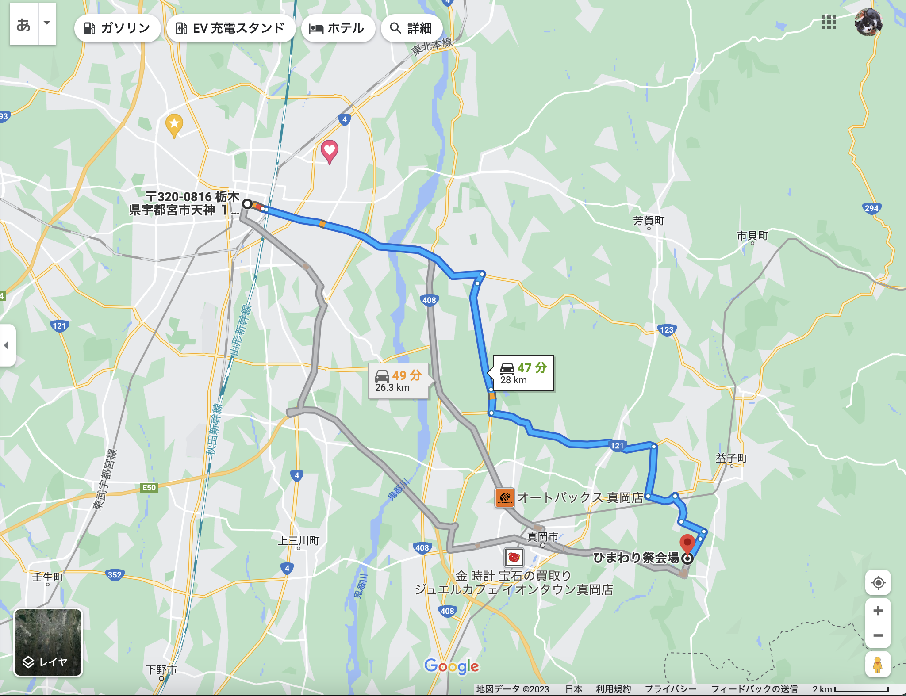</a>
<a href="20230812_001.JPG" data-lightbox="abc">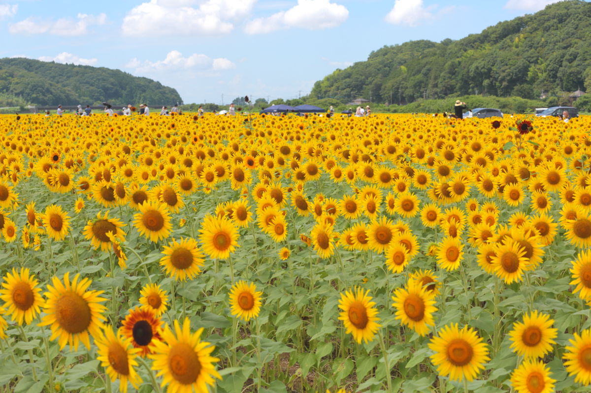</a>

<a href="20230812_003.JPG" data-lightbox="abc">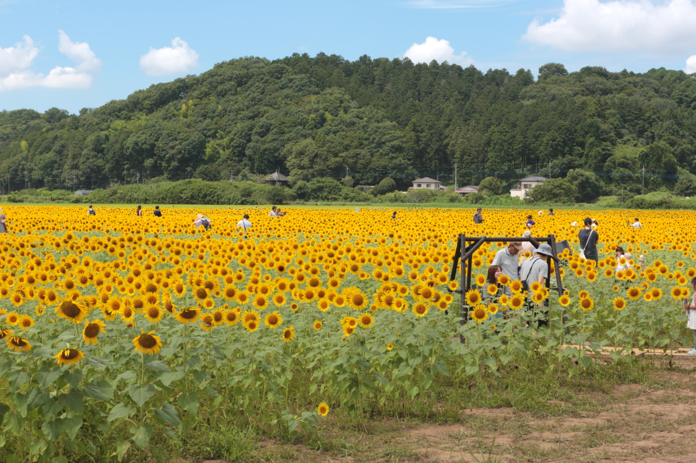</a>

<a href="20230812_005.JPG" data-lightbox="abc">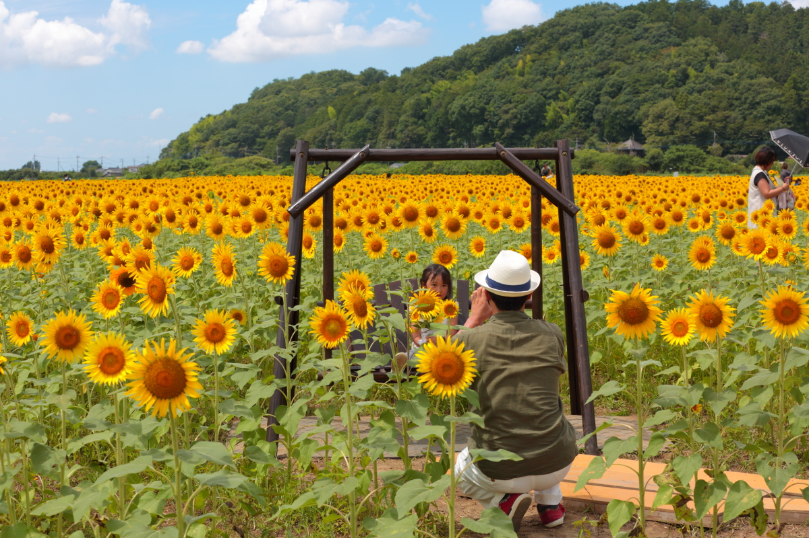</a>
<a href="20230812_006.JPG" data-lightbox="abc">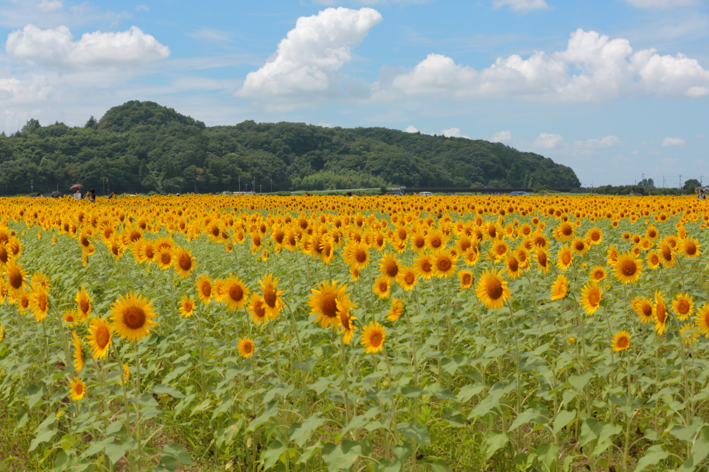</a>
<a href="20230812_007.JPG" data-lightbox="abc">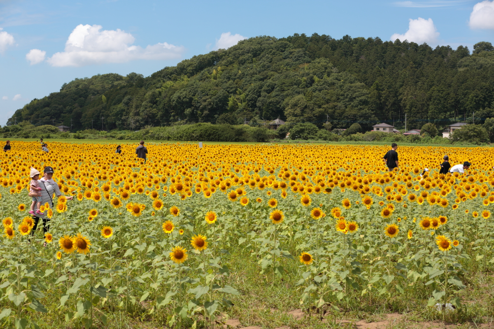</a>
<a href="20230812_008.JPG" data-lightbox="abc">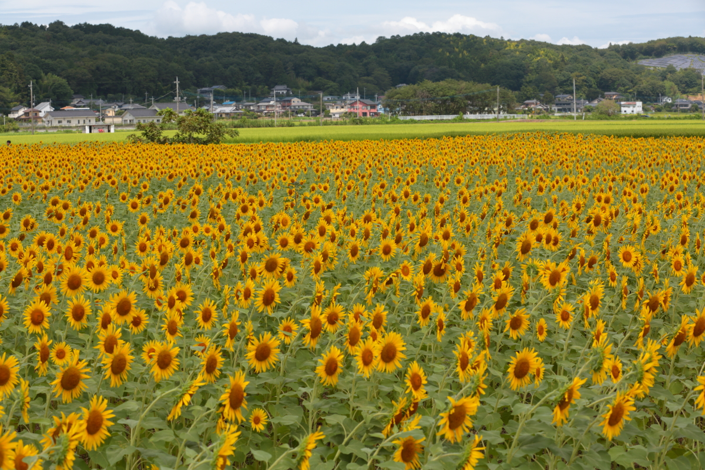</a>

<a href="20230812_010.JPG" data-lightbox="abc">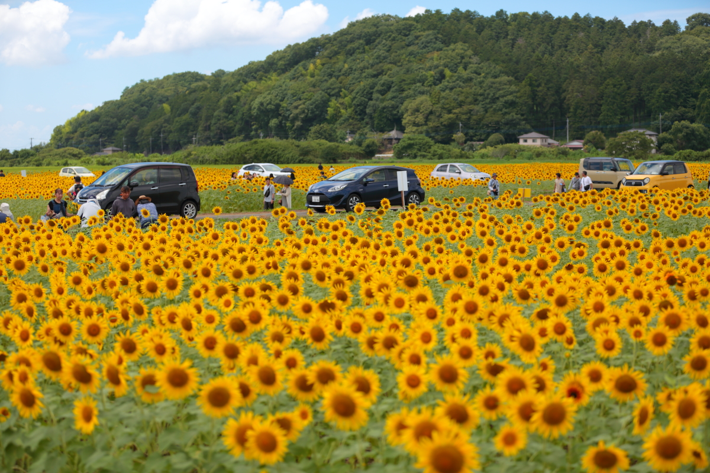</a>
<a href="20230812_011.JPG" data-lightbox="abc">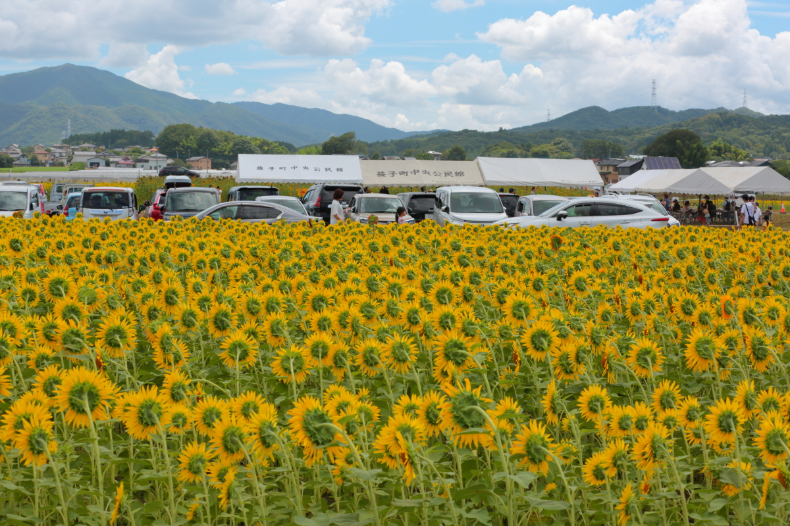</a>
<a href="20230812_012.JPG" data-lightbox="abc">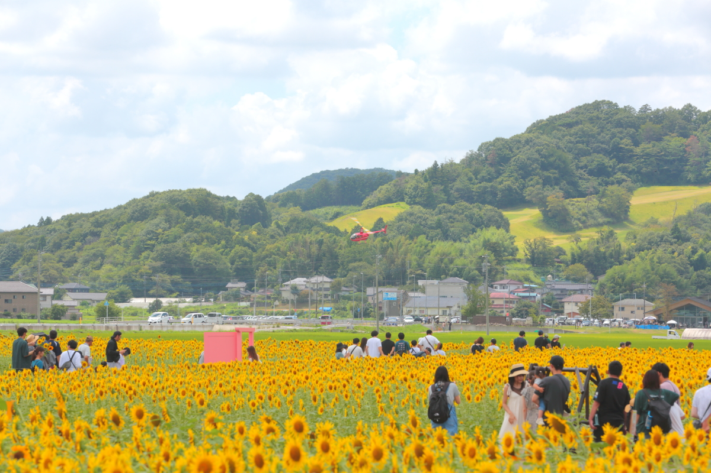</a>

<a href="20230812_016.JPG" data-lightbox="abc">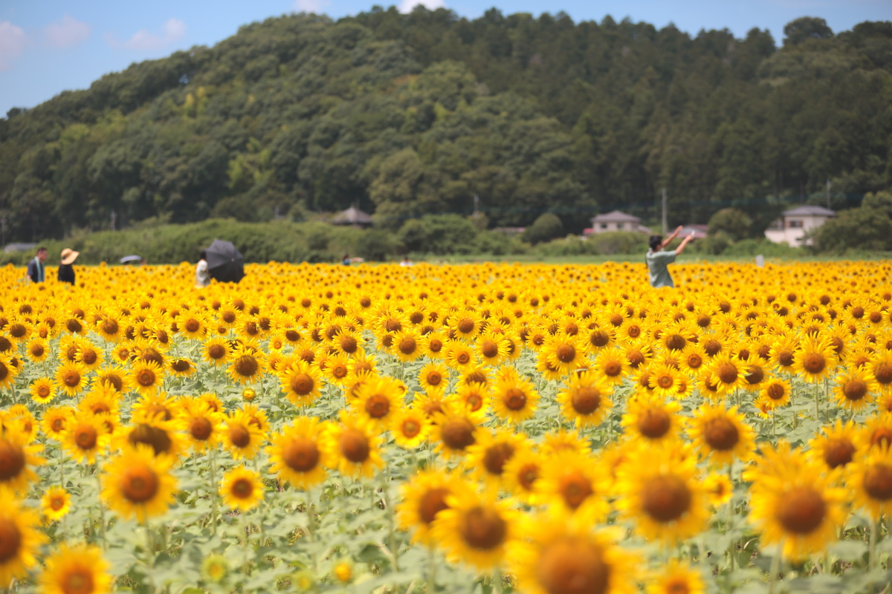</a>
<a href="20230812_017.JPG" data-lightbox="abc">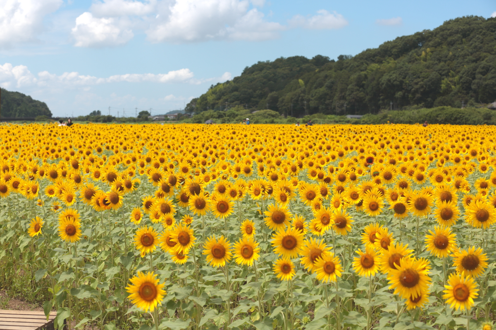</a>

<a href="20230812_019.JPG" data-lightbox="abc">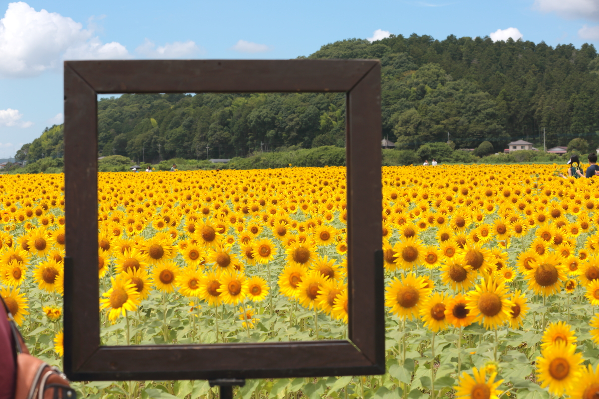</a>

<a href="20230812_026.JPG" data-lightbox="abc">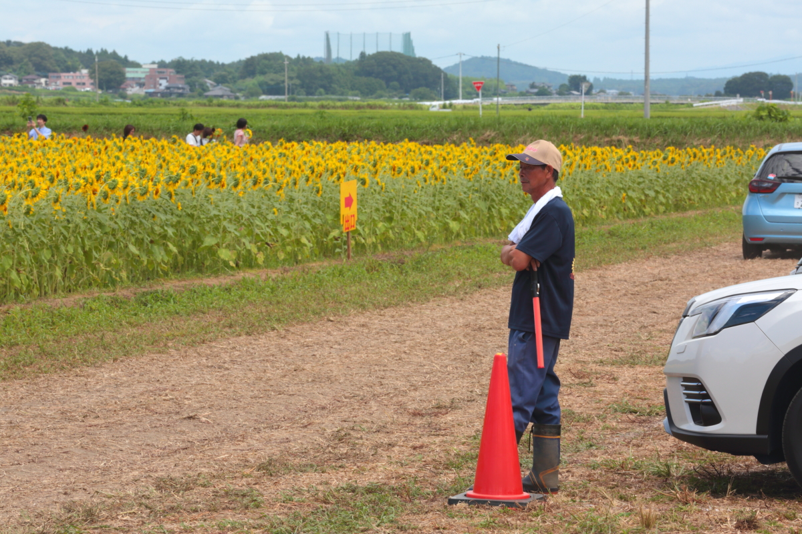</a>

<h4>↓益子、ひまわり祭りHPへのリンク</h4>
	<a href="https://www.town.mashiko.lg.jp/page/page003882.html" target="_blank"><h2>益子ひまわり祭り</h2></a>  

Map

<iframe src="https://www.google.com/maps/embed?pb=!1m18!1m12!1m3!1d57797.491997464094!2d140.03297052032545!3d36.45868618953245!2m3!1f0!2f0!3f0!3m2!1i1024!2i768!4f13.1!3m3!1m2!1s0x6021fcf6baaf53b7%3A0xbef08ba7ae9da2d0!2z44Gy44G-44KP44KK56Wt5Lya5aC0!5e0!3m2!1sen!2sjp!4v1564575158565!5m2!1sen!2sjp" width="600" height="450" frameborder="0" style="border:0" allowfullscreen></iframe>

                                       

<marquee direction="left" scrollamount="5" width="85%">去年と同じ種ですが、天候の関係で今年のお花は少し小さめとのこと！ (^_^)/~hada</marquee>

  

 

<!-- フッタ -->
 <footer>
 Copyright 2023/08/12 S.Hada
	 </footer>

</body>
</html>
